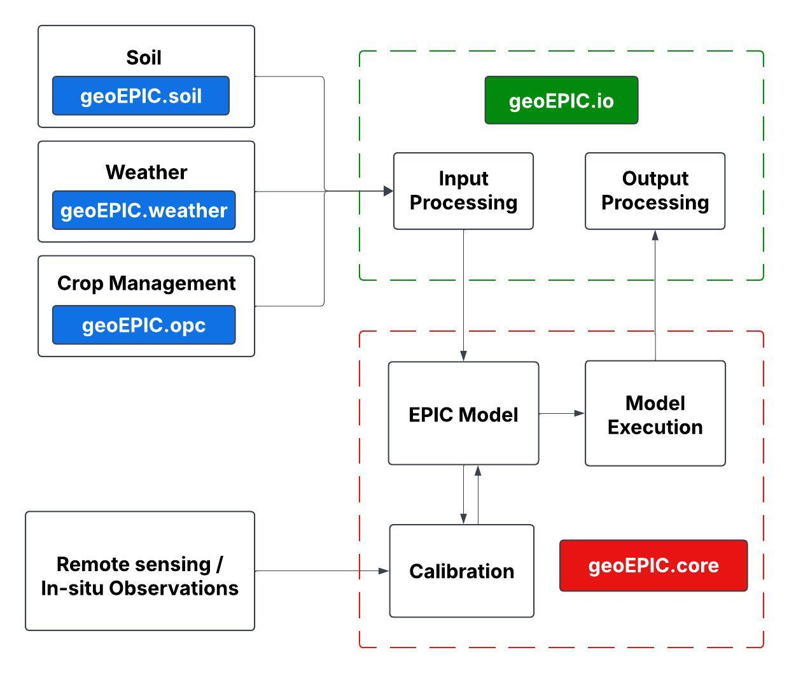

# Overview

GeoEPIC is organized into multiple modules, each contributing to distinct stages of the EPIC model workflow. Below is an overview of the modules, grouped by their roles in the workflow:

 

---

## **1. Input Generation and Processing Modules**
Input generation is critical for EPIC simulations, requiring accurate soil, weather, and management practice data. These modules automate the process by sourcing data, preprocessing it, and storing it in EPIC-compatible formats.

### **geoEpic.weather**
"This module handles weather data acquisition and preprocessing. It downloads weather information from various sources, including Daymet and Google Earth Engine. The data is processed and stored in EPIC-compatible formats, such as daily weather files (.DLY) and monthly weather files (.INP), to ensure seamless integration into simulations.

- [API Documentation for weather module](/geo_epic_win/reference/api/weather/)
- [Usage Instructions for weather module](/geo_epic_win/getting_started/weather)

### **geoEpic.soil**
The soil module focuses on preparing soil properties data. It sources soil information from SSURGO and ISRIC, processes the data into appropriate units and formats, and generates the resulting file in the .SOL format required by the EPIC model. This ensures accurate and compatible soil inputs for simulations.

- [API Documentation for soil module](/geo_epic_win/reference/api/soil/)
- [Usage Instructions for soil module](/geo_epic_win/getting_started/soil)

### **geoEpic.opc**
This module processes crop management data into the .OPC format required by EPIC simulations. The .OPC file contains detailed information about management practices conducted at a specific site, such as planting crops, fertilizer applications, irrigation schedules, harvesting operations, and tillage practices. Users can programmatically manipulate these files through GeoEPIC's OPC class, which provides methods to add new operations, modify existing ones, and save changes in the appropriate format.

- [Usage Instructions for opc module](/geo_epic_win/getting_started/opc)

---

## **2. Input and Output File Management**
Once input data is prepared, this module facilitates user interactions with both input and output files. It supports efficient data handling and visualization, helping users analyze simulation results effectively.

### **geoEpic.io**
The input/output module provides classes for managing various EPIC files, including input files (.DLY, .SOL, .OPC, .SIT) and output files (.ACY, .DGN, etc.). It serves multiple roles:

- It enables input generation modules and the model execution module to interact with and modify files seamlessly.
- It allows users to directly access and edit files for customization.

Usage instructions for this module will be detailed in the dedicated input and output pages, ensuring clear guidance for working with specific file types.

- [API Documentation for io module](/geo_epic_win/reference/api/io/)

---

## **3. Model Execution and Calibration**

The **geoEPIC.core** module is central to executing the EPIC model, configuring simulations, and fine-tuning model parameters through calibration workflows. This module provides comprehensive tools for managing every aspect of model execution and calibration. The functionalities include:

- **Model Execution**:  
  The module facilitates the execution of EPIC simulations, supporting both single-site and multi-site setups. It ensures seamless compatibility and execution, enabling precise simulations tailored to various scenarios and generating comprehensive outputs for further analysis.

- **Model Configuration**:  
  Users can set up and customize various parameters for simulations, such as start and end dates, simulation duration, and the types of outputs required. This flexibility allows users to adapt simulations to site-specific conditions or project goals.

- **Calibration**:  
  This module aligns the EPIC model's outputs with real-world observations (e.g., crop yields, biomass, LAI, NEE) by leveraging advanced optimization algorithms through the PyGMO library, such as Particle Swarm Optimization (PSO) and Differential Evolution (DE). Users can define routines and objectives to log errors, aggregate results, and guide the calibration process, ensuring flexibility and precision tailored to specific simulation needs.

- [API Documentation for core module](/geo_epic_win/reference/api/core/)
- [Usage Guide for simulation](/geo_epic_win/getting_started/simulation)
- [Usage Guide for calibration](/geo_epic_win/getting_started/calibration)

<!-- ---

## **4. Remote Sensing Module**

Remote sensing data adds valuable geospatial context to simulations, enhancing calibration and analysis workflows.

### **geoEPIC.gee**

The remote sensing module integrates data from Google Earth Engine into the modeling process. It supports downloading geospatial datasets for various geometries, including single points, multiple points, and polygons. Users can access all data available in Google Earth Engine, apply custom formulas, and preprocess datasets before integration. The module also enables parallel execution, optimizing the speed and efficiency of data downloading for large-scale operations.

- [API Documentation for gee module](/geo_epic_win/reference/api/gee/)
- [Usage Guide for remote sensing module](/geo_epic_win/getting_started/gee/) -->
