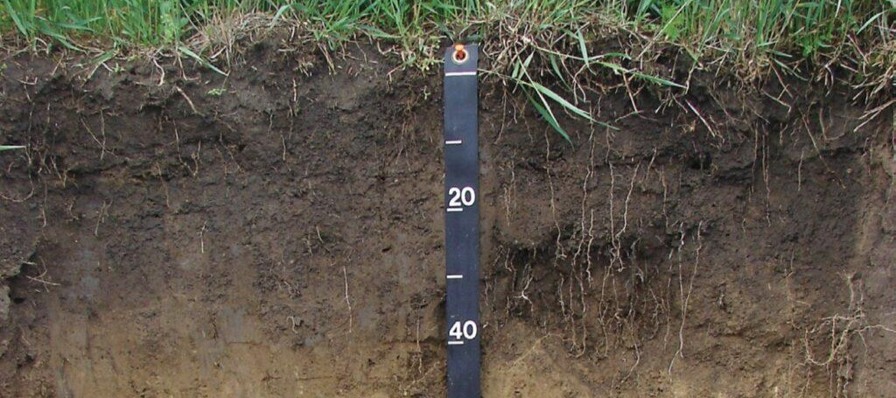

# **Soil Module**

In agriculture simulations, such as those conducted using the EPIC model, soil data directly influences water availability, nutrient supply, and overall crop growth predictions. Soil input files to the model contain detailed information about the soil properties of a specific location, depth wise.



## **1. Data Sources**

GeoEPIC helps in generating soil files required by the EPIC Model from two primary soil data sources: <br>

*   **[USDA SSURGO](https://www.nrcs.usda.gov/resources/data-and-reports/soil-survey-geographic-database-ssurgo)**: Contains detailed surveys of U.S. soils. <br>
*   **[ISRIC SoilGrids 250m](https://soilgrids.org/)**: Offers global coverage in a grid format (Support adding soon).

### **1.1 USDA SSURGO**

The USDA Soil Survey Geographic **(SSURGO)** database is a comprehensive resource for soil data collected by the Natural Resources Conservation Service **(NRCS)** across the United States and the Territories. This database provides detailed information on soil properties and classifications. The data is collected through extensive field surveys and laboratory analysis. For more detailed information, visit the [USDA NRCS SSURGO](https://www.nrcs.usda.gov/resources/data-and-reports/soil-survey-geographic-database-ssurgo) page.

## **2. Creating Soil File**

This section describes how to fetch soil data using GeoEPIC tools.

### **2.1 Requirements and Configuration**

Depending on the method chosen to generate soil files, different inputs are required:

*   **Direct Fetching from USDA SSURGO (Online):**
    You need to provide the location(s) of interest using one of the following formats:
        *   Specific latitude and longitude coordinates.
        *   A CSV file containing columns for latitude (`lat`) and longitude (`lon`).
        *   A vector boundary file (e.g., ESRI Shapefile `.shp`) defining the area(s) of interest. GeoEPIC will determine the representative soil(s) within the boundaries.
*   **Processing Local SSURGO GDB File (Offline):**
    *   Requires a pre-downloaded state Soil Survey Geographic (gSSURGO) database file (`.gdb`).
    *   These files contain all the necessary soil properties and spatial data for a specific state or territory.
    *   **Downloading the GDB:** State-specific gSSURGO databases can be downloaded from the USDA NRCS Geospatial Data Gateway or the specific [gSSURGO Database page](https://www.nrcs.usda.gov/resources/data-and-reports/gridded-soil-survey-geographic-gssurgo-database). You will typically download a `.zip` file containing the `.gdb` folder. Ensure the `.gdb` folder is extracted and accessible to the GeoEPIC command.

Ensure that the necessary input files (CSV, Shapefile, or GDB) are correctly formatted and accessible in your specified file paths when running the GeoEPIC commands or Python scripts.


### **2.2 Using Command Line (CLI)**

#### **Fetching from USDA SSURGO**

To fetch and output soil files using the USDA SSURGO database via the command line:

*   **For a specific location:** Specify the latitude and longitude coordinates to generate a soil file named {mukey}.SOL.
    ```bash
    # Fetch and output soil files for a specific latitude and longitude
    geo_epic soil usda --fetch {lat} {lon} --out {out_path}
    ```
*   **For a list of locations:** Provide a CSV file containing latitude and longitude columns.
    ```bash
    # Fetch for a list of locations in a csv file with lat, lon
    geo_epic soil usda --fetch {list.csv} --out {out_dir}
    ```
*   **For crop sequence boundaries:** Use a shapefile defining the area of interest.
    ```bash
    # Fetch for crop sequence boundaries shape file.
    geo_epic soil usda --fetch {aoi_csb.shp} --out {out_dir}
    ```

**Note:** When using a CSV file or a shapefile, this command will write the corresponding Soil IDs (mukeys) as an attribute into the input file.

#### **Processing Local SSURGO GDB File**

To process a downloaded SSURGO GDB file and generate soil files for all unique soils contained within it:

1.  Download the state-specific gSSURGO data (e.g., 'gSSURGO_MD.zip' for Maryland) from the [gSSURGO Database page](https://www.nrcs.usda.gov/resources/data-and-reports/gridded-soil-survey-geographic-gssurgo-database).
2.  Extract the contents and place the `.gdb` folder in your workspace.
3.  Use the following command:

    ```bash
    geo_epic soil process_gdb -i {path/to/ssurgo.gdb} -o {out_dir}
    ```

### **2.3 Using Python API**

To download soil data programmatically from the Soil Data Access (SDA) service, you can use the `SoilDataAccess` class. This class provides a method to fetch soil properties based on either a mukey (integer) or a WKT location string.

```python
from soil_data_access import SoilDataAccess

# Fetch soil properties using a mukey (integer)
soil_data_mukey = SoilDataAccess.fetch_properties(123456)
print(soil_data_mukey)

# Fetch soil properties using a WKT location (string)
wkt_location = "POINT(-93.62 41.58)" # Example point WKT
soil_data_wkt = SoilDataAccess.fetch_properties(wkt_location)
print(soil_data_wkt)

# Example using a Polygon WKT
# wkt_polygon = "POLYGON((-93.5 41.5, -93.5 41.6, -93.4 41.6, -93.4 41.5, -93.5 41.5))"
# soil_data_poly = SoilDataAccess.fetch_properties(wkt_polygon)
# print(soil_data_poly)

```

This `fetch_properties` method returns a Pandas DataFrame containing various soil properties (e.g., bulk density, field capacity, sand content) for the specified input.

## **3. Editing Soil File**

Soil data files (`.SOL`) contain vital information on soil properties across different layers, such as bulk density and moisture capacity. The `SOL` class in the `io` module of GeoEPIC includes methods for loading, modifying, and saving these soil files to allow customization of soil profiles.

The `geoEpic.io.SOL` class provides the primary interface for editing `.SOL` files.

**Key Components:**

*   **`SOL.load(filepath)`:** Reads a `.SOL` file into a structured `SOL` object.
*   **`SOL.save(filepath)`:** Saves the current state of the `SOL` object to a new `.SOL` file.
*   **`SOL.layers_df`:** A Pandas DataFrame attribute within the `SOL` object representing the soil layers. Each row corresponds to a layer, allowing direct manipulation of layer properties (e.g., `Bulk_Density`, `Field_Capacity`).
*   Other attributes like `SOL.albedo` allow modification of general soil properties.

**Example Usage:**

The following example demonstrates loading a soil file, modifying its albedo and the bulk density of the first layer, and then saving the changes to a new file.

```python
from geoEpic.io import SOL

# Load the existing .SOL file
soil = SOL.load('./umstead.SOL')

# Modify a general soil property (albedo)
soil.albedo = 0.15

# Modify a property in the first layer (index 0) using the layers_df DataFrame
soil.layers_df.loc[0, 'Bulk_Density'] = 1.35

# Save the modified soil profile to a new file
soil.save('umstead_new.SOL')
```

In this example, the `load()` method reads the `.SOL` file into the `soil` object. Properties like `albedo` can be accessed and modified directly. The soil layers are accessed via the `layers_df` Pandas DataFrame, providing a convenient way to target and manipulate individual layer properties using standard DataFrame operations (like `.loc`). Finally, the `save()` method writes the updated soil profile to `umstead_new.SOL`.

The ability to edit individual soil attributes enables users to fine-tune soil profiles based on specific knowledge or to simulate how different soil conditions influence model outputs.