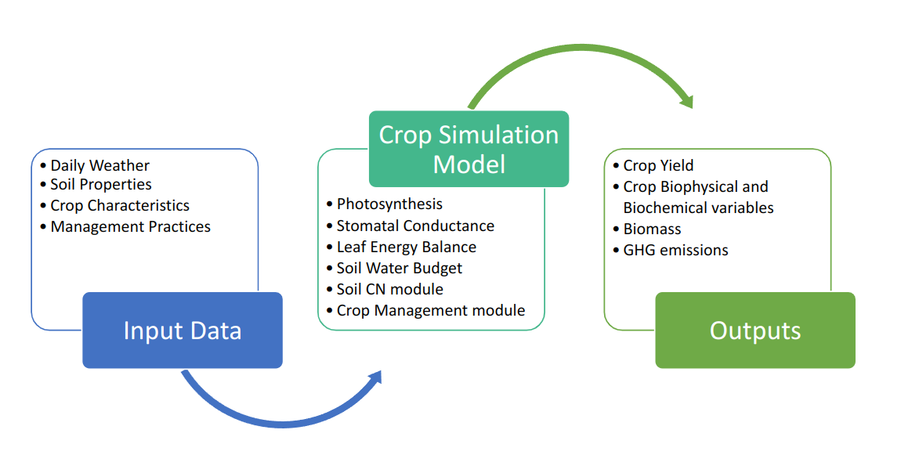

## Environmental Policy Integrated Climate Model

The Environmental Policy Integrated Climate **(EPIC)** model, originally known as the Erosion/Productivity Impact Calculator, is **designed to simulate a field, farm or small watershed**, that is homogenous in terms of climate, soil, land use, and topography. The model simulates biophysical and biogeochemical processes as influenced by climate, landscape, soil and management conditions.Processes simulated include plant growth and yield, water and wind erosion, and water, carbon and nutrient cycling. EPIC is capable of **simulating around hundred crops** including annual, perennial and woody cropping systems grown as monocultures or polycultures. Model has been validated for multiple crops and in over 30 countries and regions and it has been used to assess productivity, environmental impacts, sustainability and climate change impacts and mitigation. EPIC has regularly been used by federal programs to investigate potential impacts of agricultural policies.

For more details on EPIC model, visit [Texas A&M AgriLife site](https://epicapex.tamu.edu/about/epic/). 

 

<!--  -->
 

Initially developed in the early 1980s, **(J. R. Williams,
Jones, & Dyke, 1984)**. EPIC integrated components from previous models such as CREAMS **(Knisel, 1980)** and SWRRB **(J. R. Williams, Nicks, & Arnold, 1985)**. The model was later enhanced with a pesticide component from GLEAMS **(Leonard, 1987)** to assess pesticide fate, further developed by **Sabbagh, Geleta, Elliott, Williams, & Griggs (1991)**. EPIC has evolved to address broader issues such as global climate change impacts, biomass production for energy, and landfill design, making it a versatile tool in environmental and agricultural management.

<!-- The EPIC model offers high temporal resolution, simulating agricultural systems on a daily basis over long periods. It features refined algorithms for water quality, nutrient cycling, climate impacts, and atmospheric CO2 effects. This adaptable model evaluates various cropping and management practices to optimize agricultural strategies and calculate erosion costs. -->

 
<!--   -->
**Refer to the user manual for detailed guidance on using EPIC:**
 
 <!-- [# epic1102-user-manual-2024-01-24.pdf](./epic1102-user-manual-2024-01-24.pdf) -->

<object data="../assets/epic1102-user-manual-2024-01-24.pdf" type="application/pdf" width="101%" height="700px">
  
Alternative text for the PDF

</object>
