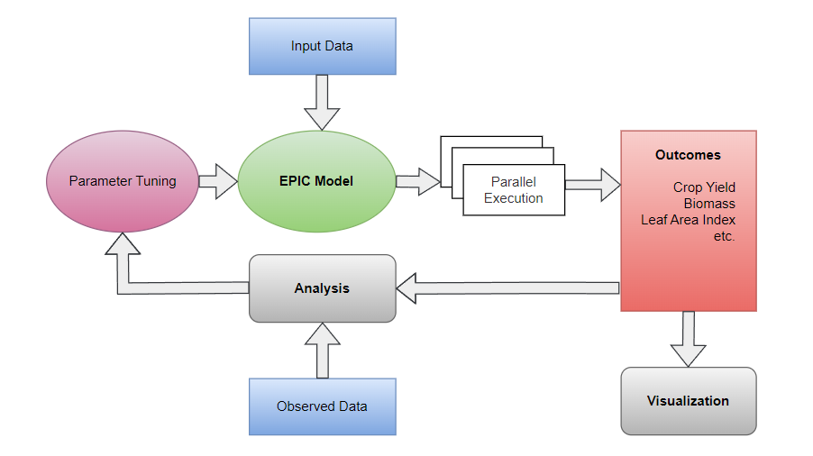

# Model Parameter Calibration

The Calibration Module in GeoEPIC is developed to assist in tuning desired parameters involved in the EPIC model based on observational data, such as Leaf Area Index (LAI), Net Ecosystem Exchange (NEE), crop yield, or biomass. This allows model parameters to be refined to better reflect specific local conditions or experimental results.



### Getting Started

- If the package is installed in a conda environment, activate it in commond prompt with
    ```bash
    conda activate epic_env
    ```
- By this point, the workspace folder must be setup with all the required input files.
- Lets say, target_yields.csv has reported yield values with SiteID, Yield as columns, we would like to calibrate few parameters so that the simulated yields match with the target yields.
- Add files required for Calibration from geo_epic with
   ```bash
      cd [your_workspace folder]
      geo_epic copy calibration_utils
   ```
- Refer calibration_starter.ipynb, which has the following lines of code.

### Import required Modules


```python
import numpy as np
import pandas as pd
from geoEpic.io import Parm, CropCom
from geoEpic.core import Workspace

import os
import pygmo as pg
```

### Initiate the workspace class
- Edit the required options in the config.yml file.


```python
exp = Workspace('./config.yml')

#clear the logs and output directory
exp.clear_logs()
exp.clear_outputs() 
```

### load parameter files and set sensitive parameters


```python
# Load default cropcom.DAT file from the calibration folder
cropcom = CropCom('./calibration_files/defaults')

# Set few parameters as sensitive for calibration.
cropcom.set_sensitive(['./calibration_files/sensitivity/cropcom_yld.csv'], [2]) # here 2 is the crop code for corn

# save the loaded cropcom.DAT to model folder
cropcom.save(f'./model')
```

##### Verify sensitive parameters


```python
cropcom.prms
```


```python
ieparm = Parm('./calibration_files/defaults')
ieparm.set_sensitive(['./calibration_files/sensitivity/parm_yld.csv'])
ieparm.save(f'./model')
```

```python
ieparm.prms
```

### Load target yields file


```python
target_yields = pd.read_csv('path/to/target.csv')
exp.target_yields = target_yields.set_index('SiteID')['yields'].to_dict()
```

### Define an objective function
- @exp.logger routine is called after every site simulation and site object is passed as input. logger outputs are saved for later use.
- @exp.objective routine is called after finishing simulation on all sites, It is useful to get the fitness for optimization 


```python
@exp.logger
def yield_error(site):
  '''
  Process EPIC outputs to extract data and carry out required computation.
  '''
  target_yield = exp.target_yields[site.site_id]
  simulated_yields = ACY(site.outputs['ACY']).get_var('YLDG')
  last_year_yield = simulated_yields['YLDG'].values[-1]
  return {'error': np.abs(target_yield - last_year_yield)}

@exp.objective
def aggregate():
  '''
  Aggregate all the logged error values to return as objective 
  '''
  logged_data = exp.fetch_log('yield_error')
  logged_data = logged_data.dropna()
  return [logged_data['error'].mean()]
```

### Run Calibration
- Choose necessary settings and optimization algorithm
- Follow this link for [pygmo docs](https://esa.github.io/pygmo2/overview.html)


```python
import pygmo as pg
from geoEpic.core import PygmoProblem

# define pygmo problem with workspace and parameter files
problem = PygmoProblem(exp, cropcom, parm)
print('Fitness before Optimzation:', exp.run())
```


```python
# Choose an algorihm and settings
algo = pg.algorithm(pg.pso_gen(gen = 45, memory = True))
algo.set_verbosity(1) 

print("Initial Population")
population = pg.population(problem, size = 50)

print("Optimizing...")
population = algo.evolve(population) 
```


```python
print('Fitness After Optimzation:', exp.run())
```
