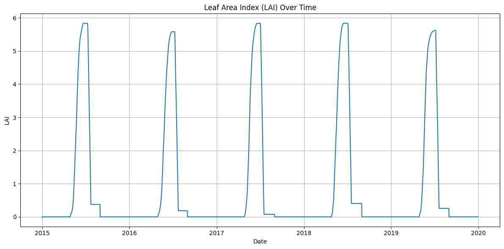

# EPIC Model Simulation Tutorial

This notebook demonstrates how to use the EPIC model with the geoEpic package.

- If the package is installed in a conda environment, activate it in commond prompt with
    ```bash
    conda activate epic_env
    ```
- Set up a GeoEPIC workspace using
    ```bash
    geo_epic workspace -n Test
    ```
- Start a Jupyter notebook inside the workspace folder
    ```bash
    cd Test
    jupyter notebook
    ```
## Follow the below lines of code

Import the required classes from geoEpic

```python
from geoEpic.core import Site, EPICModel
from geoEpic.io import ACY, DGN
```

First create a `Site` object with the necessary input files. 


```python
site = Site(opc = './opc/files/umstead.OPC',
            dly = './weather/NCRDU.DLY',
            sol = './soil/files/umstead.SOL',
            sit = './sites/umstead.SIT')
print(site.site_id)
```

    umstead
    

#### Define the EPICModel class
Now Let's create an `EPICModel` object and specify the start date, duration of the simulation.


```python
model = EPICModel('./model/EPIC1102.exe')
model.start_date = '2015-01-01'
model.duration = 5
model.output_types = ['ACY']
```

Run the model simulations at the required site

```python
model.run(site)
# Close the model instance
model.close()
# Path to output files is stored in the site.outputs dict
site.outputs
```

- EPICModel instance can also be created using a configuration file. 
Example config file:
```yaml
# Model details
EPICModel: ./model/EPIC1102.exe
start_year: '2015-01-01'
duration: 5
output_types:
  - ACY  # Annual Crop data file
  - DGN  # Daily general output file
log_dir: ./log
output_dir: ./output
```
- This method allows for easier management of model parameters.

#### Using EPICModel class with Configuration File

```python
model = EPICModel.from_config('./config.yml')
model.run(site)
model.close()

#using with context
with EPICModel.from_config('./config.yml') as model:
    model.run(site)
```

#### Examine the outputs
Finally, examine the outputs generated by the model run.


```python
yields = ACY(site.outputs['ACY']).get_var('YLDG')
yields
```


<div>
<style scoped>
    .dataframe tbody tr th:only-of-type {
        vertical-align: middle;
    }

    .dataframe tbody tr th {
        vertical-align: top;
    }

    .dataframe thead th {
        text-align: right;
    }
</style>
<table border="1" class="dataframe">
  <thead>
    <tr style="text-align: right;">
      <th></th>
      <th>index</th>
      <th>YR</th>
      <th>CPNM</th>
      <th>YLDG</th>
    </tr>
  </thead>
  <tbody>
    <tr>
      <th>0</th>
      <td>0</td>
      <td>2015</td>
      <td>CORN</td>
      <td>7.175</td>
    </tr>
    <tr>
      <th>1</th>
      <td>1</td>
      <td>2016</td>
      <td>CORN</td>
      <td>4.735</td>
    </tr>
    <tr>
      <th>2</th>
      <td>2</td>
      <td>2017</td>
      <td>CORN</td>
      <td>9.072</td>
    </tr>
    <tr>
      <th>3</th>
      <td>3</td>
      <td>2018</td>
      <td>CORN</td>
      <td>7.829</td>
    </tr>
    <tr>
      <th>4</th>
      <td>4</td>
      <td>2019</td>
      <td>CORN</td>
      <td>5.434</td>
    </tr>
  </tbody>
</table>
</div>


Plot the simulated Leaf Area Index


```python
import matplotlib.pyplot as plt

lai = DGN(site.outputs['DGN']).get_var('LAI')

plt.figure(figsize=(12, 6))
plt.plot(lai['Date'], lai['LAI'])
plt.title('Leaf Area Index (LAI) Over Time')
plt.xlabel('Date')
plt.ylabel('LAI')
plt.grid(True)
plt.tight_layout()
plt.show()

```


    

    

